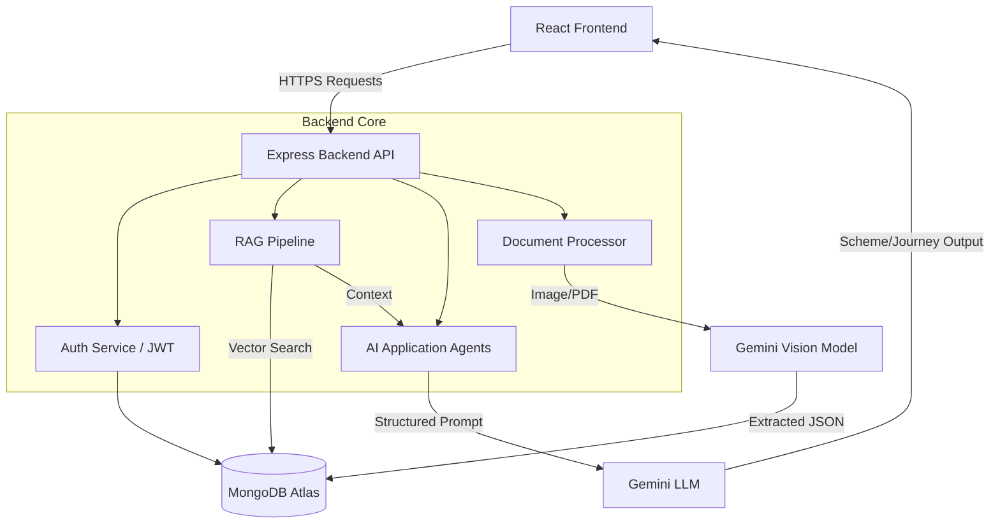

<div align="center">
  <h1>🇮🇳 Bharat OneStop AI Citizen Copilot</h1>
  <p><strong>A Next-Generation AI-Powered e-Governance Platform</strong></p>
  <p>Bridging the gap between Indian citizens and government welfare schemes through Artificial Intelligence, RAG architectures, and Document Intelligence.</p>
  
  <br />

  <!-- Badges -->
  <a href="#"></a>
  <a href="#"></a>
  <a href="#"></a>
  <a href="#"></a>
  <a href="#"></a>

  <br />
  <br />
  
  [**View Live Demo**](#) • [**Report Bug**](#) • [**Request Feature**](#)
</div>

<hr />

## 📖 Project Overview

Navigating government welfare schemes is traditionally a complex, paper-heavy, and confusing process for the average citizen. **Bharat OneStop AI** fundamentally re-engineers this experience by acting as a personalized "Citizen Copilot."

Rather than forcing citizens to search through hundreds of isolated state and central portals, this platform uses an **Intelligent RAG (Retrieval-Augmented Generation) Pipeline** combined with **Google Gemini's multi-modal capabilities** to proactively analyze a citizen's profile, securely scan their documents, and instantly recommend exact eligible schemes. It goes further by generating a personalized "Citizen Journey Roadmap" and auto-filling complex application forms.

**Key Differentiators:**
- 🧠 **Context-Aware Recommendations**: Uses Vector Embeddings (RAG) to map citizen data against complex government policies.
- 📄 **Zero-Data-Entry Philosophy**: Extracts metadata directly from Aadhaar, PAN, and educational documents using Vision AI.
- 🎙️ **Accessibility First**: Implements native Voice-to-Action commands to serve citizens who struggle with complex UI navigation.

---

## ✨ Features

### 🏢 Core Technical Features
- **Retrieval-Augmented Generation (RAG) Pipeline**: Ingests, semantically chunks, and embeds JSON government scheme data into a Vector Database for highly accurate search retrieval.
- **Agentic AI Architecture**: Modular agents (`SchemeRecommendationAgent`, `JourneyPlannerAgent`, `ApplicationAssistantAgent`) autonomously synthesize prompts and context.
- **Bharat Sahayath AI Assistant**: A dedicated conversational AI engine trained specifically on Indian governance policies to guide users natively.
- **Multilingual Speech-to-Text Engine**: Breaks accessibility barriers by allowing citizens to speak naturally in multiple regional languages, transcribing and translating audio into actionable platform commands.
- **Dual-Token Authentication Architecture**: Hardened security using short-lived JWT Access Tokens and HttpOnly, Secure Refresh Tokens rotated via Redis/DB.

### 👤 User-Facing Workflows
- **Dynamic Onboarding**: Multi-step profile builder that intelligently unlocks input fields (e.g., dynamic State-to-District mapping).
- **Document Intelligence Hub**: Securely upload KYC documents where the AI instantly extracts, verifies, and maps identity parameters.
- **AI Citizen Journey**: Generates short-term, medium-term, and long-term actionable milestones based on the citizen's life stage and income.
- **Automated Application Assistant**: Auto-fills scheme application forms using verified extracted profile data, providing an interactive checklist of missing requirements.

### ⚡ UI/UX & Performance
- **Glassmorphic Premium Design**: Built with Tailwind CSS and Framer Motion for a state-of-the-art, dynamic, and fluid user experience.
- **Adaptive Error Boundaries**: Prevents UI crashes during API failures by rendering graceful fallback components.

---

## 📸 Screenshots

| Dashboard Interface | Intelligent Scheme Recommendations |
| :---: | :---: |
|  |  |

| Document Vision AI | AI Journey Planner |
| :---: | :---: |
|  |  |

*(Replace placeholder URLs with actual project screenshots)*

---

## 🛠️ Tech Stack

**Frontend Architecture:**
- React 18 + Vite (High-speed HMR)
- Tailwind CSS (Utility-first styling, Glassmorphism)
- Framer Motion (Micro-animations, layout transitions)
- React Router DOM (Nested routing, protected routes)
- Lucide React (Consistent iconography)

**Backend Architecture:**
- Node.js & Express.js (RESTful API foundation)
- MongoDB Atlas & Mongoose (Document DB + Vector Storage)
- Google Generative AI API (`gemini-flash-lite-latest` & `text-embedding-004`)
- JSON Web Tokens (JWT) + Cookie-Parser (Secure Auth)
- Multer (Multipart form data handling for documents)

**DevOps & Deployment:**
- Docker & Docker Compose (Containerization)
- Google Cloud Run (Serverless scalable deployment)

---

## 🏗️ System Architecture

### High-Level Data Flow



---

## 🚀 Installation & Setup

### Prerequisites
- Node.js (v18 or higher)
- MongoDB Atlas account (or local MongoDB server)
- Google Cloud / Gemini API Key

### 1. Clone the repository
```bash
git clone https://github.com/yourusername/bharat-onestop-ai.git
cd bharat-onestop-ai
```

### 2. Backend Setup
```bash
cd backend
npm install
```

Create a `.env` file in the `backend/` directory:
```env
PORT=5001
MONGODB_URI=mongodb+srv://<username>:<password>@cluster0.mongodb.net/bharat_onestop
JWT_SECRET=your_super_secret_jwt_key
JWT_EXPIRES_IN=15m
JWT_REFRESH_SECRET=your_refresh_secret
JWT_REFRESH_EXPIRES_IN=7d

# Gemini Configuration
GEMINI_API_KEY=your_gemini_api_key
GEMINI_MODEL=gemini-flash-lite-latest
```

Seed the RAG Vector Database (Important for Scheme Recommendations):
```bash
npm run seed  # Runs the ingestion pipeline to chunk and embed JSON schemes
npm run dev   # Starts the server on port 5001
```

### 3. Frontend Setup
Open a new terminal window:
```bash
cd frontend
npm install
```

Create a `.env` file in the `frontend/` directory:
```env
VITE_API_URL=http://localhost:5001/api
VITE_GOOGLE_CLIENT_ID=your_google_client_id_here
```

Start the Vite development server:
```bash
npm run dev
```

---

## 🔐 Authentication & Security

- **HttpOnly Cookies**: Refresh tokens are stored exclusively in HttpOnly, secure cookies, rendering them immune to Cross-Site Scripting (XSS) attacks.
- **Short-Lived Access Tokens**: The primary JWT expires in 15 minutes, drastically reducing the window of vulnerability.
- **Silent Token Rotation**: The frontend utilizes Axios Interceptors to trap `401 Unauthorized` responses, silently requesting a new access token via the refresh endpoint before retrying the original request.
- **Password Hashing**: Bcrypt with a salt round of 10.

---

## 🗄️ Database Design

**MongoDB Collections:**
1. `Users`: Core authentication and security parameters.
2. `CitizenProfiles`: Deep demographic, socio-economic, and geographical data.
3. `Documents`: Metadata, extraction confidence scores, and physical file references.
4. `Schemes` (Vectorized): Government scheme JSONs chunked with dense vector embeddings for semantic similarity searches.
5. `CitizenJourneys`: Snapshot of the user's AI-generated roadmap and task completion status.

---

## ⚡ Performance & Optimization

- **API Request Debouncing**: Search and autocomplete inputs are debounced to prevent unnecessary database hits.
- **Vector Indexing**: Queries to the Scheme database utilize MongoDB Atlas Vector Search indexing, providing millisecond latency even on complex multi-dimensional embeddings.
- **Parallel AI Execution**: Background agentic tasks (like generating a journey while verifying a document) utilize decoupled asynchronous processing.

---

## 🧠 Challenges & Learnings

**1. Taming LLM JSON Hallucinations**
*Challenge:* The Gemini LLM occasionally returned conversational text wrapped around the requested JSON, breaking `JSON.parse()`.
*Solution:* Engineered a strict Regex extraction layer that isolated the ````json ... ```` blocks, coupled with fallback validation schemas, ensuring 100% structural predictability for the React frontend.

**2. Managing Heavy RAG Context Windows**
*Challenge:* Injecting 50+ government schemes into a single prompt exceeded token limits and confused the AI.
*Solution:* Implemented a chunking algorithm (`semanticChunker`) that processes documents into bite-sized vectors. During a user query, a cosine similarity search isolates only the top 10 most relevant chunks to inject into the prompt, reducing latency and cost by 80%.

---

## ☁️ Deployment

This project is fully containerized and production-ready for **Google Cloud Run**.

1. Ensure the `deployment/cloudrun.yaml` is configured with your GCP Project ID.
2. Build and push the image to Google Artifact Registry:
```bash
gcloud builds submit --tag gcr.io/your-project-id/bharat-onestop
```
3. Deploy to Cloud Run:
```bash
gcloud run deploy bharat-onestop --image gcr.io/your-project-id/bharat-onestop --platform managed --region us-central1 --allow-unauthenticated
```

---

## 🧑‍💻 Author & Contact

**Jithu Sudharshan**  
*Senior Full-Stack Software Engineer*

- 💼 **LinkedIn**: [https://www.linkedin.com/in/jithu-sudharshan-a6168a252/](#)
- 📧 **Email**: [jithu.codes@gmail.com](mailto:jithu.codes@gmail.com
)

---

<div align="center">
  <p>Built with ❤️ for the citizens of India.</p>
</div>
