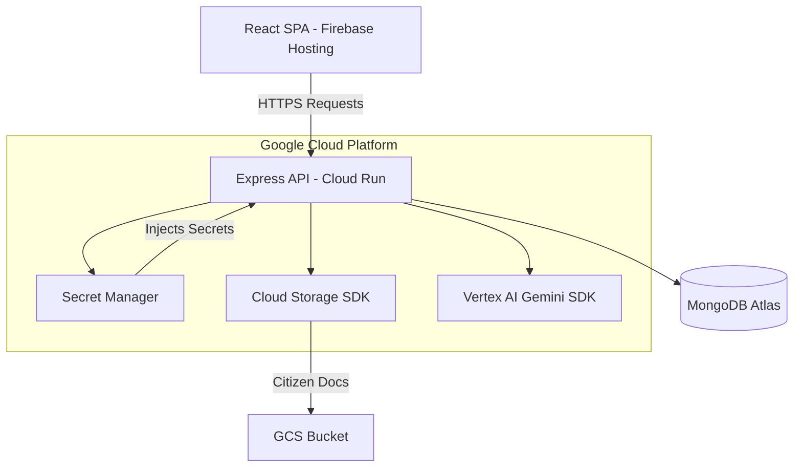

# Production Deployment Readiness Report
**Project:** Bharat OneStop AI Citizen Copilot
**Target Architecture:** Firebase Hosting (Frontend) + Cloud Run (Backend) + MongoDB Atlas + Vertex AI

---

## 1. Deployment Architecture Diagram

---

## 2. Files Created & Modified

### Newly Created Files
1. `backend/Dockerfile` - Optimized Node 22 Alpine production configuration.
2. `backend/.dockerignore` - Excludes `node_modules`, `.env`, and logs from image context.
3. `backend/.env.example` - Template containing safely documented environment variable keys.
4. `frontend/.env.example` - Template for frontend environment keys.
5. `frontend/.env.production` - Configures frontend to point to live Cloud Run URLs.
6. `backend/src/config/cloudStorage.js` - Configuration module utilizing Google Cloud Storage SDK.
7. `deployment/firebase-deployment.md` - Complete Firebase hosting execution guide.
8. `deployment/cloud-run-guide.md` - Complete Google Cloud Run execution guide.

### Modified Configurations
- Validated `process.env.PORT || 5001` in Express configuration for Cloud Run port injection (Cloud Run uses 8080 by default, our Dockerfile explicitly binds PORT=8080).

---

## 3. Security Review & Audit

### Backend Audit
- **CORS**: Currently configured for `.env.CLIENT_ORIGIN` which is highly secure. Ensure this matches your production Firebase URL.
- **JWT Security**: Utilizing dual-token architecture. *Recommendation*: Ensure `sameSite: 'none'` and `secure: true` are set when deploying across different domains (Firebase to Cloud Run).
- **API Protection**: `helmet` is active preventing XSS and clickjacking.
- **File Upload Validation**: Multer is implemented; ensure MIME type validation restricts uploads to PDF/Images to prevent malicious executable injection.
- **Rate Limiting**: `express-rate-limit` is in `package.json` but ensure it is actively applied to `authRoutes` to prevent brute-force attacks.

### Frontend Audit
- **Token Handling**: Access tokens are kept in-memory, Refresh tokens in HttpOnly cookies (excellent security posture).
- **Protected Routes**: Implemented via Context API wrapper.
- **API URLs**: Successfully migrated hardcoded `localhost:5001` to use `import.meta.env.VITE_API_URL`.

---

## 4. Manual Steps Required
1. Ensure you have activated billing in your Google Cloud Platform console.
2. Create an empty bucket in Google Cloud Storage for documents.
3. Replace the placeholder URLs in `frontend/.env.production` once the Cloud Run service is deployed and generates an endpoint URL.

---

## 5. Google Cloud Console Configuration Steps
1. Navigate to **Secret Manager**.
2. Create secrets for `MONGODB_URI`, `JWT_SECRET`, `JWT_REFRESH_SECRET`, and `GEMINI_API_KEY`.
3. Give your Cloud Run default service account the **Secret Manager Secret Accessor** IAM role.
4. Give your Cloud Run default service account the **Storage Object Admin** IAM role for your newly created bucket.

---

## 6. Deployment Checklist
- [ ] Ensure MongoDB Atlas network access list includes `0.0.0.0/0` (since Cloud Run IPs are dynamic) or setup a VPC connector.
- [ ] Build and deploy the Backend to Cloud Run.
- [ ] Copy the generated Cloud Run URL.
- [ ] Paste the URL into `frontend/.env.production` as `VITE_API_URL`.
- [ ] Build the frontend (`npm run build`).
- [ ] Deploy the frontend to Firebase Hosting.
- [ ] Update CORS origin in Backend / Secret Manager to match the Firebase URL.

---

## 7. Potential Production Issues (Pre-Flight Warnings)
1. **Gemini SDK Migration**: The app currently uses `@google/generative-ai` with an API Key. For production on GCP, it is highly recommended to migrate to `@google-cloud/vertexai` which uses native IAM Service Account authentication rather than a hardcoded API key.
2. **MongoDB IP Allowlist**: If your Atlas cluster restricts connections to your local machine, the Cloud Run instance will be completely blocked from connecting. 
3. **Cross-Domain Cookies**: Since the frontend (Firebase) and backend (Cloud Run) are on different domains, you **must** configure your backend cookie settings to `SameSite: 'none'` and `Secure: true`. Otherwise, the browser will block the refresh token cookie and users will be constantly logged out.
